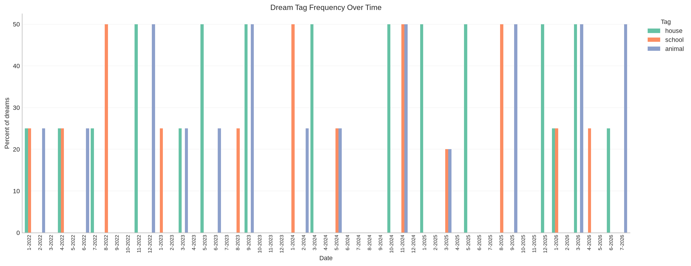

# Dream Analyzer

Small local pipeline for parsing a dream journal, embedding dreams with Ollama,
storing them in ChromaDB, and asking retrieval-augmented questions.  
The goal is to analyze a private dream journal over time while keeping all raw journal data local. The project is designed to support semantic dream retrieval, theme extraction, longitudinal analysis, graphing, and eventually a CLI/GUI interface where a user can ask natural-language questions about their dream journal.  
🚧🛠️ This project is a work in progress. 🛠️🚧

## Setup

```bash
pip install -r requirements.txt
pip install -e .
ollama pull nomic-embed-text
ollama pull qwen3:8b
```

The editable install makes both the reusable `dream_analysis` package and the
commands under `src/cli/` importable while developing from the repository.

At least one embedding model and chat model are needed. Ollama must be running locally at `http://localhost:11434`.

## Workflow

Format the journal as plain text, with each group of dreams beginning with a date
in `M/D/YY` or `M/D/YYYY` format. Put optional tags on one or more `#tag`-only
lines at the beginning of a dream. Separate multiple dreams from the same date
with blank lines; a new date also begins a new dream.

```text
1/22/2022
#house #recurring
There was an extra room behind the pantry.

I found a notebook in a freezer.

2/3/22
#animal
A white dog followed me through a grocery store.
```

The parser automatically detects whether one or two consecutive blank lines
separate dreams. If a journal uses a different convention, set it explicitly
with `--dream-separator-blank-lines`.

The same parsing behavior is reusable in Python through
`dream_analysis.parser.JournalParser`; the CLI only handles file input and
JSONL output.

The included `data/mock_dream_journal.txt` contains synthetic example data for testing and
demonstrating this format. It is the default input, so you can run the code
without supplying your own journal:

```bash
python3 src/cli/parse_dreams.py
```

To parse your own journal, provide input and output paths:

```bash
python3 src/cli/parse_dreams.py path/to/journal.txt data/my_dreams.jsonl
```

Build the ChromaDB index:

```bash
python3 src/cli/build_chroma_db.py
```

Embeddings are generated from dream text only; metadata is stored separately.

## Retrieval scoring

Dream retrieval currently follows two scoring paths. The scores have opposite
directions and should not be compared directly.

| Command | Retrieval score | Behavior |
|---|---|---|
| `retrieve_dreams.py` | Chroma distance | Lower is closer. |
| `basic_rag.py` | Chroma distance | The generated or supplied retrieval query is ranked by Chroma. |
| `dream_agent.py` | Chroma distance | `search_dreams` uses Chroma ranking; optional dates filter that ranked search. |
| `evaluate_retrieval.py` | Configurable | Defaults to Chroma distance; `--retrieval-metric cosine` uses cosine similarity and `both` compares them. |
| `compare_models.py rag` | Chroma distance | Uses the same retrieval path as `basic_rag.py`. |
| `analyze_dream.py --related-dreams ...` | Cosine similarity | Higher is more similar; `--similarity-threshold` is a cosine threshold. |
| `compare_models.py analyze` | Cosine similarity | Uses the same related-dream path as `analyze_dream.py`. |

Collections built by this repository do not explicitly configure Chroma's
distance space, so Chroma's current default applies: squared L2 distance. The
explicit related-dream path instead loads stored embeddings, calculates cosine
similarity in Python, filters by the similarity threshold, and sorts from
highest to lowest. Because the project does not normalize embeddings before
storage, the two paths can return different rankings for the same input.

`cluster_dreams.py` is not a retrieval command. It L2-normalizes stored vectors,
uses cosine distance for UMAP, uses cosine similarity for representative
selection, and uses Euclidean distance for HDBSCAN clustering.

## Current Tools

Retrieve similar dreams:

```bash
python3 src/cli/retrieve_dreams.py "hidden room water" --top-k 5
```

Plot tag frequency over time:

```bash
python3 src/cli/plot_tags.py --tags house recurring school
```

Cluster the existing dream embeddings and generate theme evidence, static plots,
an interactive map, and per-dream assignments:

```bash
python3 src/cli/cluster_dreams.py
python3 src/cli/cluster_dreams.py --label-clusters
```

Cluster labels summarize recurring content and are not psychological diagnoses.
The optional `--label-clusters` flag uses the local Ollama chat model; clustering
itself does not require new model calls.

Compute summary stats:

```bash
python3 src/cli/compute_stats.py --freq Y
```

Analyze one dream:

```bash
python3 src/cli/analyze_dream.py --dream-id dream-2022-1-22-0
python3 src/cli/analyze_dream.py --dream-id dream-2022-1-22-0 --related-dreams 5
```

Extract structured features for every dream or one dream:

```bash
python3 src/cli/structure_dreams.py
python3 src/cli/structure_dreams.py --dream-id dream-2022-1-22-0 --overwrite
```

Build a fillable character lookup from those structured records without more
LLM calls:

```bash
python3 src/cli/build_character_lookup.py --temporal-context
```

Ask a RAG question:

```bash
python3 src/cli/basic_rag.py "What patterns appear in dreams about hidden rooms?"
```

Or let a tool-capable Ollama model choose the semantic search query and use the
results in an agent loop:

```bash
python3 src/cli/dream_agent.py "What patterns appear in dreams about hidden rooms?"
python3 src/cli/dream_agent.py "What are common themes in dreams from last month?"
python3 src/cli/dream_agent.py \
  "What are common themes in dreams about school? Use only dreams from last month."
python3 src/cli/dream_agent.py "What patterns recur in school dreams?" \
  --output outputs/agent/school_patterns.md
python3 src/cli/dream_agent.py "Compare house and school dreams" \
  --max-tool-calls 3 \
  --debug \
  --output outputs/agent/comparison_trace.md
```

The agent exposes one read-only tool, `search_dreams`. It accepts optional,
inclusive `start_date` and `end_date` bounds in `YYYY-MM-DD` format. The agent
translates relative language into those bounds using the current date; "last
month" means the previous calendar month. Topic terms such as "school" remain
part of the semantic query while the date bounds filter the results. Search
queries, result counts, and per-dream context are bounded before being returned
to the model. `--output` optionally saves the question, settings, searches,
selected date ranges, retrieved citations, the full text of every unique dream
returned across the searches, and the answer as Markdown. Repeated results remain
listed in their search tables, but their full text appears only once. The full
report text is captured from the same search but is not added to the model's
bounded context.

Exact duplicate tool calls reuse the first result instead of querying Chroma
again, but still count toward `--max-tool-calls`. When that budget is exhausted,
the agent makes one final synthesis request with tools disabled. This is a fresh
request with a synthesis-specific system prompt and an explicit evidence packet
built from completed searches, rather than relying on earlier `tool` messages
remaining in the model's context. The packet deduplicates dreams and is sized
from `--num-ctx`; individual dream text may be marked
`[TRUNCATED FOR SYNTHESIS]`. Calls beyond the remaining budget are marked
unexecuted and shown in the console and report.

If a model stops searching but returns an empty answer, the agent also makes one
forced no-tools synthesis attempt. If that attempt is empty, the command saves
a partial report when `--output` is supplied and exits with status 2. Add
`--debug` to print and save every normalized assistant message together with
Ollama diagnostics such as `done_reason`, prompt and generation token counts,
durations, available thinking content, and the exact forced-synthesis prompt and
evidence packet. Debug tracing is opt-in because model messages may contain
private journal details.

The deterministic reporting logic is also available independently of the CLI
and Ollama. `DreamStatisticsService`, `TagTrendService`, and
`CharacterLookupService` accept validated records and return JSON-compatible
results. The command-line scripts remain responsible only for loading files,
plotting, and saving outputs; these service boundaries can later be exposed as
read-only LLM tools.

Compare the four chat/embedding combinations (qwen3:8b and gemma3:12b for chat, nomic-embed-text and qwen3-embedding for embedding) with a fixed retrieval query:

```bash
python3 src/cli/compare_models.py rag \
  "What patterns appear in dreams about hidden rooms?" \
  --retrieval-query "hidden room hallway extra room concealed door behind wall"
```

Evaluate each embedding model's top retrievals with Gemma:

```bash
python3 src/cli/evaluate_retrieval.py "hidden room hallway concealed door" --top-k 8
python3 src/cli/evaluate_retrieval.py \
  "hidden room hallway concealed door" \
  --top-k 8 \
  --retrieval-metric both
python3 src/cli/evaluate_retrieval.py \
  --dream-id dream-2022-1-22-0 \
  --focus "discovering a hidden room that reveals a disturbing secret" \
  --retrieval-metric both \
  --top-k 8
```

In dream-ID mode, retrieval always embeds the complete target dream. `--focus`
changes only Gemma's evaluation criterion. Reports include the complete target
and retrieved dream texts. With `--retrieval-metric both`, each embedding model
is evaluated once with Chroma distance and once with explicit cosine similarity.
The report includes shared top-k counts, Jaccard overlap, dreams unique to each
metric, and the cosine-minus-Chroma difference in mean judged relevance. Unique
candidates are pooled and judged once without exposing their retrieval source.

Use a manual retrieval query when the question has extra analysis language:

```bash
python3 src/cli/basic_rag.py \
  "What patterns appear in dreams about hidden rooms?" \
  --retrieval-query "hidden room hallway extra room concealed door behind wall"
```

See `example_usages.md` for more detailed command examples and arguments.

## Example Results

The following results were generated from the included example journal, which
contains 151 dreams dated from 2022 through 2026.

### Longitudinal Tag Analysis

The normalized view shows how often each of the most common tags appears as a
percentage of dreams recorded that month.



Summary statistics generated by `compute_stats.py`:

| year | dreams |
|---:|---:|
| 2022 | 38 |
| 2023 | 36 |
| 2024 | 30 |
| 2025 | 27 |
| 2026 | 20 |

The three most common tags were `house` (15 dreams), `animal` (13), and
`school` (12).

### Retrieval-Augmented Analysis

For the question *“What patterns appear in dreams about hidden rooms?”*, the
pipeline retrieved dreams involving concealed rooms and hallways, doors behind
walls or appliances, and recurring objects such as keys, maps, photographs, and
cryptic labels. The generated synthesis identified two broader patterns:

- Hidden spaces tend to appear inside otherwise familiar places.
- Discovery is frequently paired with hesitation, warnings, or a sense of being
  watched.

### Model Comparison

`compare_models.py` ran the same retrieval prompt across four local
chat/embedding combinations. These are the recorded timings from that run;
performance will vary by hardware.

| chat model | embedding model | retrieval | generation | total |
|---|---|---:|---:|---:|
| qwen3:8b | nomic-embed-text | 0.158 s | 23.206 s | 23.364 s |
| gemma3:12b | nomic-embed-text | 0.158 s | 89.822 s | 89.980 s |
| qwen3:8b | qwen3-embedding | 5.445 s | 16.662 s | 22.108 s |
| gemma3:12b | qwen3-embedding | 5.445 s | 69.323 s | 74.769 s |
